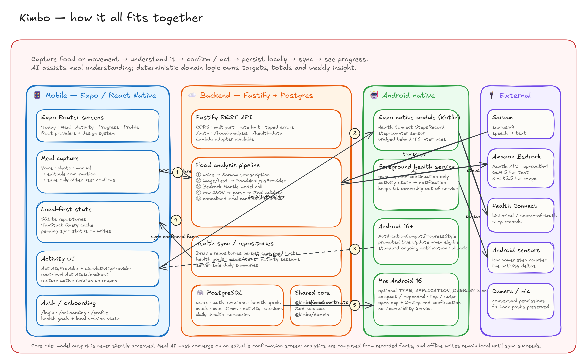
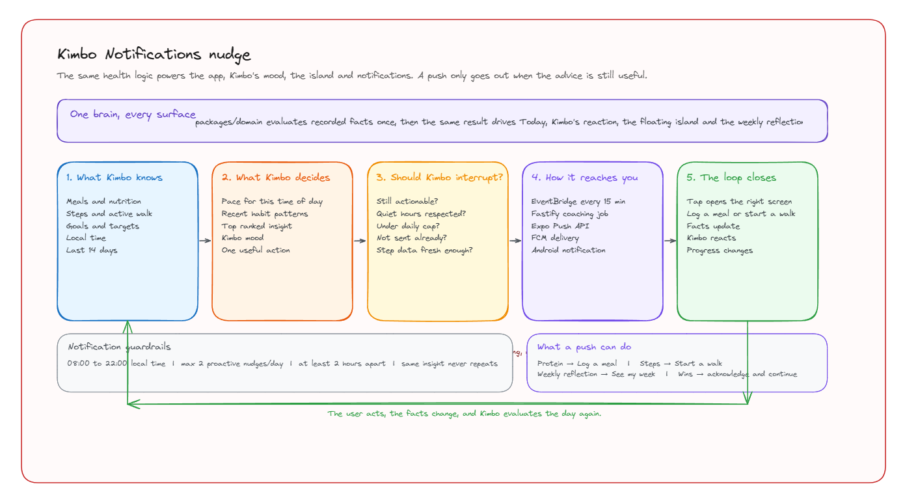

<div align="center">
  
  <h1>Kimbo</h1>
  <p><strong>A health companion that lives on your phone, not just in an app.</strong></p>
  <p>Say what you ate, snap your plate or start a walk. Kimbo turns it into calories, protein and steps, understands how your day is going, and reacts from a <b>Dynamic Island</b> that floats over every app.</p>
  <br/>
  <p>
    
    
  </p>
  <p>
    <a href="https://github.com/herin7/kimbo/actions/workflows/ci.yml"></a>
    <a href="https://github.com/herin7/kimbo/issues"></a>
    <a href="https://github.com/herin7/kimbo/stargazers"></a>
  </p>
</div>

---

Most health apps are good at storing numbers. The hard part is getting someone to keep logging,
understand what the numbers mean, and act on them while it still matters.

**Kimbo** is built around that loop: **set goals → log meals or move → understand the day →
notice something useful → act → see whether the habit improved.**

Tap the island in any app, say *"two rotis and dal"*, and Kimbo transcribes it, works out the
nutrition and asks you to confirm, without opening the app. Start a walk and Kimbo keeps tracking
in the background. Come back later and he doesn't just show numbers; he reacts to the day and
nudges you only when there's still something worth doing.

**AI helps understand messy input. It never invents health conclusions.**

## ✨ Key Features

* **🏝️ Kimbo Mode**: a floating Dynamic Island-style overlay with calories, protein, steps and
  Kimbo's mood. Start or end a walk and log a meal by voice from any app.
* **🎙️ Voice, photo or manual meals**: every flow ends on the same editable confirmation. AI output
  is a draft, never a saved fact.
* **🚶 Live walks**: Health Connect gives the daily baseline, and the step-counter sensor plus a
  foreground service keep a walk alive, with Android 16 Live Updates where supported.
* **🧸 Kimbo has moods**: a Rive character whose mood follows what you actually did and how the
  day is going.
* **🔔 Smart coaching**: Kimbo notices when protein, calories or movement drift off pace and
  nudges only when the advice is still actionable.
* **📈 Weekly reflection**: one thing that went well, one pattern, one small focus for next week.
* **📴 Local-first**: meals and walks are saved on the device first and synced later.

## 🛠️ Tech


Expo + React Native with a custom Kotlin Expo module for the Android system pieces. Fastify +
PostgreSQL on AWS Lambda. Sarvam for speech; Bedrock text and vision models for meal understanding.

## 🏛️ How It Works

<div align="center">
  
  <p><em><a href="https://excalidraw.com/#json=VfXKgBeC_CFlNA5IZ0UvZ,LVTCfoHBGqHk7fYNYlcpFQ">Open the editable architecture diagram</a></em></p>
</div>

**Food:** voice, photo or text → Sarvam transcription (voice) → Bedrock analysis → Zod validation
→ editable candidate → **you confirm** → SQLite → synced to Postgres. The model never writes a
confirmed health fact.

**Movement:** Health Connect baseline → start a walk → step-counter sensor → foreground service →
saved locally → synced. The island is a thin native shell; health logic and state stay in the
shared app layer.

## 🔔 How Kimbo Decides When To Nudge You

<div align="center">
  
  <p><em><a href="https://excalidraw.com/#json=1pNKhGLMhhi3zWfEh1Mv5,onvchc6mWcHmFshK9xh9wQ">Open the editable coaching diagram</a></em></p>
</div>

**One brain, every surface.** `packages/domain` evaluates recorded facts once (meals, steps,
targets, local time and the last 14 days). The same result drives Today, Kimbo's mood, the island,
push notifications and the weekly reflection, so they never contradict each other.

**Pace, not flat thresholds.** 3,000 steps at 10 AM and at 8 PM don't mean the same thing. Kimbo
compares the day with where it should be by now, and with your own recent pace.

| Insight | Example |
|---|---|
| 🥚 Protein behind (only if still recoverable) | "You're at 42 g of 120. About 38 g in each remaining meal keeps the target realistic." |
| 🥗 Calories moving fast | "A protein-and-veg dinner plus a short walk can keep the rest of the day steady." |
| 🚶 Movement behind | "949 steps so far; you usually have about 7,700 by now. A 20-minute walk still earns useful partial credit." |
| 💛 Back on track | "That walk did it. Steps are back on pace." |
| 🎉 Goal achieved | Protein, steps, or both |
| 📈 Weekly reflection | What went well · one pattern · one focus for next week |

**Guardrails.** Quiet before 08:00 and from 22:00 local time · max 2 proactive nudges a day, at
least 2 hours apart · the same insight never repeats in a day · stale advice is dropped · step
advice needs fresh step data · at most one push per run, the most useful one. Wins and comebacks
are counted separately. If there's nothing useful to say, Kimbo stays quiet.

**Delivery.** The phone syncs meals, a daily summary and its push token. EventBridge runs the
coaching job every 15 minutes in each user's local time → Expo Push → FCM → Android. Each push
deep links to the fix: protein → **Log a meal**, movement → **Start a walk**, weekly → **See my
week**.

**Kimbo's mood follows the same logic:** calm morning → *Kimbo*, good meal or a comeback →
*Pleased*, on a walk → *Hyped*, falling behind → *Worried*, still far behind late in the day →
*Fired up*. He can be dramatic; his advice never is, and a heavy meal never brings guilt.

## 📱 The App

| Surface | What it does |
|---|---|
| **Onboarding** | Derives calorie, protein and step goals |
| **Today** | Kimbo's take on the day, progress and the most useful next action |
| **Meal** | Voice, photo or manual capture → editable confirmation |
| **Activity** | Live walk metrics and the Kimbo Mode toggle |
| **Progress** | History, streaks, consistency and the weekly reflection |
| **Kimbo Mode** | Floating island with totals, mood, walk controls and voice logging |

Permissions are asked in context, and denying one never blocks the rest of the app.

## 🚀 Shipping

* **CI** (`.github/workflows/ci.yml`) runs typecheck, tests and a full build on pushes and PRs
  (docs-only changes are skipped).
* **App builds** use EAS: `preview` produces an arm64 APK, `production` an app bundle. OTA updates
  cover JavaScript-only changes; Kotlin changes need a new build.
* **Backend** is bundled for Lambda; migrations use Drizzle.

## 💻 Running Locally

Requires Node.js 22+, PostgreSQL, Android Studio (SDK 36) and JDK 17. Set `AI_PROVIDER=mock` to run
without Sarvam or Bedrock credentials.

<details>
<summary>Step-by-step setup</summary>

```sh
git clone https://github.com/herin7/kimbo.git
cd kimbo
npm install
cp .env.example .env
cp apps/mobile/.env.example apps/mobile/.env.local   # EXPO_PUBLIC_API_URL

createdb -h 127.0.0.1 -U postgres kimbo
npm run db:migrate --workspace @kimbo/api
npm run db:seed-demo --workspace @kimbo/api          # optional demo accounts

npm run dev:api                                      # port 3000
cd apps/mobile && npx expo run:android
```

The emulator reaches your computer at `http://10.0.2.2:3000`; a physical device needs your LAN IP.
Backend secrets must never use the `EXPO_PUBLIC_` prefix. Kimbo has custom native code, so it
doesn't run in Expo Go.

</details>

## 🧪 Tests

```sh
npm run typecheck
npm test
```

Covers health targets, meal totals, progress, weekly reflection, Kimbo reactions, coaching rules
and API validation. Health Connect, sensors, Kimbo Mode and push channels still need a real device.

## 📂 Project Structure

```
kimbo/
├── apps/
│   ├── mobile/     Expo app: routes, features, design system, Kotlin island module
│   └── api/        Fastify API: auth, food analysis, health data, coaching job, migrations
├── packages/
│   ├── contracts/  Shared Zod schemas and types
│   └── domain/     Framework-free targets, progress, Kimbo reactions and coaching
└── .github/        CI, OTA workflow and README assets
```

## 🙏 Attribution

Kimbo's face is [Mood interaction by ardraawork](https://rive.app/marketplace/27639-52202-mood-interaction/)
from the Rive Marketplace, used under the CC BY license.

Kimbo is not a medical device and makes no claim of clinical precision.
